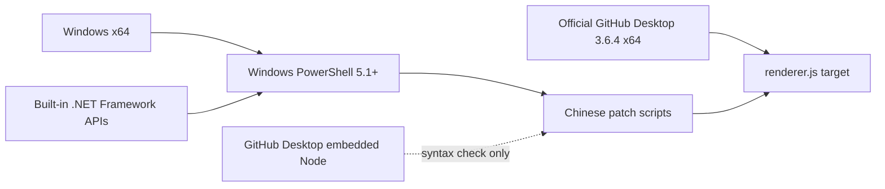
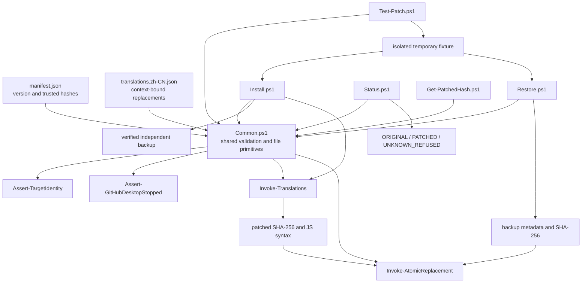
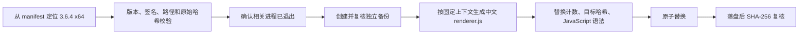

<!-- SPDX-License-Identifier: GPL-3.0-only -->

# 依赖与代码关系

## 外部依赖

| 依赖 | 要求 | 用途 |
| --- | --- | --- |
| Windows | x64 | 目标操作系统与系统 API |
| Windows PowerShell | 5.1 或更高 | 执行补丁、恢复、状态和测试脚本 |
| .NET Framework 系统类库 | 随 Windows PowerShell 提供 | SHA-256、UTF-8、JSON、文件与进程检查 |
| GitHub Desktop | 官方 3.6.4 x64 | 被校验和修改的上游目标，不包含在本仓库中 |
| GitHub Desktop 内置 Electron/Node | 随目标程序提供 | 仅使用 `GitHubDesktop.exe --check` 验证生成后的 JavaScript 语法 |

本仓库没有 NuGet、npm、PowerShell Gallery 或其他第三方 PowerShell 模块依赖，也不会打包 GitHub Desktop 本体或上游资源。

## 入口与共享代码关系

## 安全数据流

任何未知版本、未知哈希、重解析点路径、正在运行的目标进程或验证失败都会在写入前停止；恢复流程同样拒绝覆盖未知文件状态。
